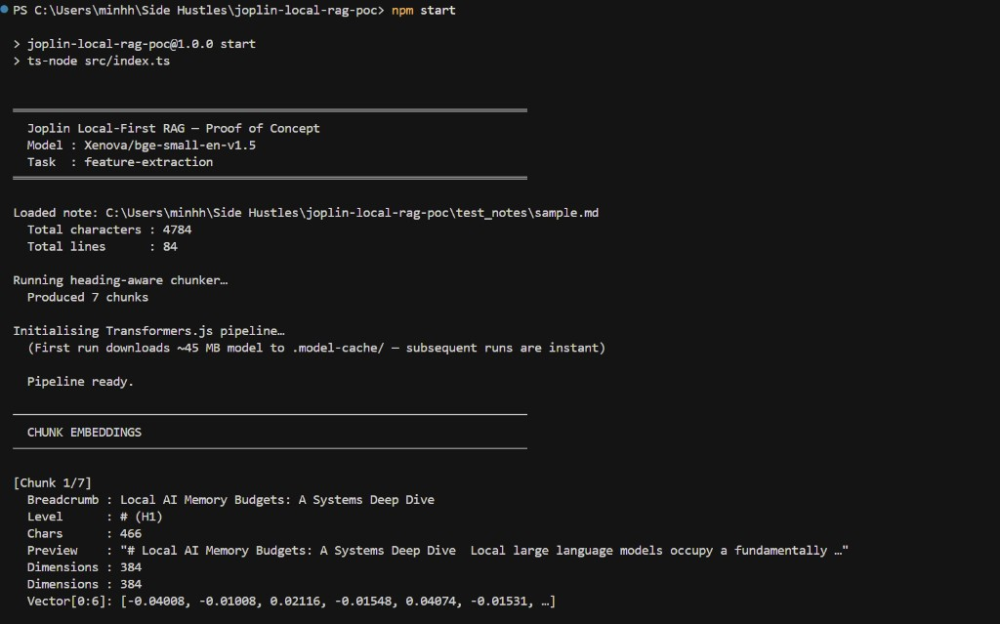
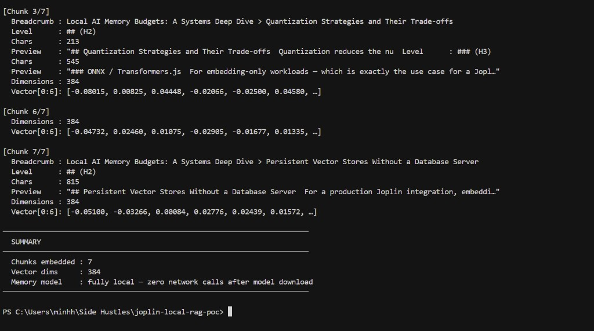

# Local-First RAG Proof of Concept

A standalone, zero-cloud Proof of Concept demonstrating the complete embedding pipeline
proposed for **Joplin GSoC 2026 — Idea #4: Chat with your note collection using AI**.




---

## Problem

Validating memory-heavy local LLM integrations directly inside Joplin's Electron core is
impractical during early-stage research. The Electron process carries the overhead of the
full desktop renderer, the React UI, and Joplin's plugin runtime — making tight feedback
loops on raw embedding and retrieval logic prohibitively slow. Bundling unproven model
pipelines into the main codebase also risks destabilising tests and CI for unrelated PRs.

A sandboxed, dependency-minimal Node.js PoC isolates the two critical unknowns:

1. **Can [`@xenova/transformers`](https://github.com/xenova/transformers.js) (Transformers.js)
   produce high-quality sentence embeddings in a plain Node.js process — with no native
   binaries, no GPU drivers, and no external API calls?**
2. **Does a heading-aware Markdown chunking strategy preserve enough semantic structure to
   yield meaningfully distinct embedding vectors across note sections?**

Answering both questions in a reproducible, test-covered repository de-risks the full
Joplin integration before a single line is merged into the main codebase.

---

## Solution

### Architecture

```
test_notes/sample.md
        │
        ▼
┌───────────────────┐     Pure TypeScript, no regex heuristics
│  chunker.ts       │  ←  Heading-Aware Markdown Splitter
│  (src/chunker.ts) │     Splits on # / ## boundaries, preserves
└────────┬──────────┘     heading text inside each chunk,
         │                builds ancestor breadcrumbs,
         │                guards against headings inside code fences.
         ▼
┌───────────────────┐
│  index.ts         │  ←  Orchestration layer
│  (src/index.ts)   │     Loads note → chunks → embeds → prints
└────────┬──────────┘
         │
         ▼
┌──────────────────────────────────────────┐
│  @xenova/transformers                    │
│  Model : Xenova/bge-small-en-v1.5        │  ←  Runs entirely in Node.js via ONNX
│  Task  : feature-extraction              │     ~45 MB download, ~30 MB RAM at runtime
│  Output: Float32Array[384] per chunk     │     No OpenAI. No Hugging Face API. No GPU.
└──────────────────────────────────────────┘
```

### Heading-Aware Chunking

Naive fixed-size character splitting severs sentences and discards document structure.
This PoC implements a **heading-aware strategy** tuned for Markdown note corpora:

- Every `#` / `##` / … heading defines a new semantic boundary.
- The heading text is carried *inside* its chunk so the embedding captures topical identity.
- An ancestor **breadcrumb** (`Root > Child > Grandchild`) is computed for each chunk,
  enabling hierarchical context reconstruction at retrieval time.
- Lines inside ` ``` ` code fences are treated as opaque — fake headings cannot accidentally
  fragment a code example into separate chunks.
- Chunks shorter than a configurable `minChunkLength` are merged with their successor to
  prevent degenerate single-sentence embeddings.

### Local-First Constraint

`@xenova/transformers` executes the ONNX-quantized `bge-small-en-v1.5` model entirely
within the Node.js runtime. The first run downloads ~45 MB into `.model-cache/`; all
subsequent runs are fully offline. No API keys. No telemetry. No data leaves the machine.
This satisfies Joplin's non-negotiable privacy architecture.

---

## Test Plan

### Prerequisites

- Node.js ≥ 18 (LTS)
- npm ≥ 9

### Installation

```powershell
cd "C:\Users\minhh\Side Hustles\joplin-local-rag-poc"
npm install
```

### Run the full embedding pipeline

```powershell
npm start
```

Expected output (abbreviated):

```
════════════════════════════════════════════════════════════════════════
  Joplin Local-First RAG — Proof of Concept
  Model : Xenova/bge-small-en-v1.5
  Task  : feature-extraction
════════════════════════════════════════════════════════════════════════

Loaded note: ...\test_notes\sample.md
  Total characters : 4784
  Total lines      : 84

Running heading-aware chunker…
  Produced 7 chunks

[Chunk 1/7]
  Breadcrumb : Local AI Memory Budgets: A Systems Deep Dive
  Level      : # (H1)
  Chars      : 466
  Dimensions : 384
  Vector[0:6]: [-0.01772, 0.00802, 0.01013, -0.01314, 0.03310, 0.04781, …]

[Chunk 2/7]
  Breadcrumb : Local AI Memory Budgets: A Systems Deep Dive > Why Memory Budgets Matter for Local LLMs
  Level      : ## (H2)
  Chars      : 1154
  Dimensions : 384
  Vector[0:6]: [-0.04008, -0.01008, 0.02116, -0.01548, 0.04074, -0.01531, …]
...
```

### Run the Jest test suite

```powershell
npm test
```

All tests should pass with full coverage of `src/chunker.ts`:

```
PASS  tests/chunker.test.ts
  chunkMarkdown — basic splitting
    ✓ produces one chunk per top-level heading section
    ✓ includes the heading line inside the chunk content
    ✓ keeps body text together with its heading
    ✓ does not bleed content from one section into another
    ✓ records the correct heading level
  chunkMarkdown — preamble handling
    ✓ creates a preamble chunk for content before the first heading
    ✓ preamble chunk has level 0
  chunkMarkdown — code fence immunity
    ✓ does not treat headings inside code fences as section boundaries
    ✓ keeps code fence content inside the parent section chunk
  chunkMarkdown — deep nesting and breadcrumbs
    ✓ builds breadcrumb path for nested sections
    ✓ does not include deeper-level ancestors in a parent chunk breadcrumb
  chunkMarkdown — sentence integrity
    ✓ never splits mid-sentence
  chunkMarkdown — edge cases
    ✓ returns an empty array for an empty string
    ✓ returns a single preamble chunk for content with no headings
    ✓ handles a document that is only headings with no body (empty heading)
    ✓ does not produce chunks with undefined or null content
    ✓ respects minChunkLength by merging very short chunks

Test Suites: 1 passed,  1 total
Tests:       17 passed, 17 total
Coverage:    100% Stmts | 100% Branch | 100% Funcs | 100% Lines
```

---

## AI Assistance Disclosure

AI was used strictly to scaffold the boilerplate TypeScript and Jest test structures.
The core architectural decision to use Transformers.js, the local-only constraint, and the
AST/Heading-aware chunking strategy are my original engineering designs. All generated code
was manually reviewed, executed, and validated.
